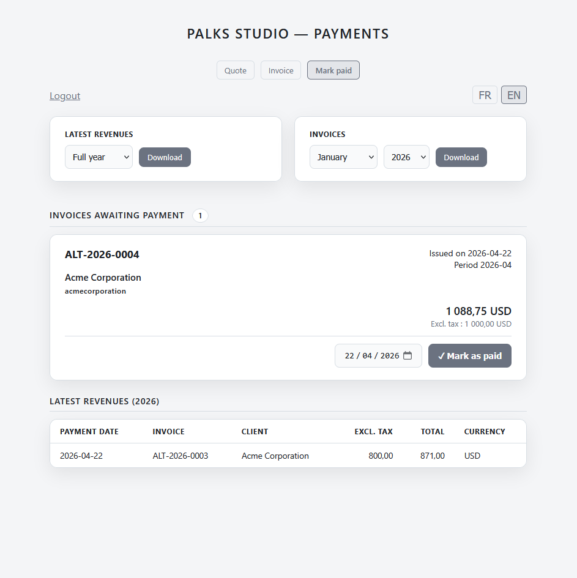

<p align="center">
  
</p>

> 🇬🇧 English | [🇫🇷 Français](./README_FR.md)


<p align="center">
  <a href="https://palks-studio.com">
    
  </a>
</p>


# Billing System

> ⚠️ This repository presents the project and its technical documentation.  
> The production version is not publicly distributed.
>
> Installation is performed directly on the client's hosting infrastructure.  
> If you are interested in using this system, please contact **Palks Studio**.

Complete, autonomous and bilingual (FR/EN) billing system deployable on any PHP/Apache hosting. No database. No SaaS dependency. Self-hosted with full ownership of your data.

---

## Overview

Billing System is a suite of three interconnected billing tools accessible from a unified interface. It covers the full lifecycle of a service engagement: from quote generation to invoice settlement, including electronic signature and structured archiving.

The system is designed to be deployed directly on the client's server, on a standard Apache hosting environment with PHP 8.x and Composer. It requires no database, no third-party service, and no subscription.

---

## Features

- Client-side quote PDF generation (jsPDF)  
- Server-side invoice PDF generation (Dompdf)  
- Automatic pre-generation of the paid invoice at billing time  
- Electronic quote signing by the client (touch/mouse canvas)  
- Client auto-fill from archives (SIREN, SIRET, VAT, email, name)  
- Structured archiving by client and period  
- Secure sequential numbering (file lock)  
- Monthly export of invoices (ZIP)  
- Monthly export of revenue records (CSV)  
- Yearly export of the revenue journal (CSV)  
- Automatic email notifications at each stage (quote, invoice, settlement)  
- Cross-module navigation bar  
- Bilingual FR/EN interface with real-time language switch  
- Dark mode / light mode with persistence  
- No database  
- No SaaS dependency  
- Basic security: secure sessions, tokens, brute-force protection

---

## Project Structure

```
billing-system-en/
│
├── billing-public/
│   │  └── assets/
│   │      ├── logo*              → User logo if provided
│   │      ├── signature.png      → User signature used on quotes and invoices
│   │      ├── favicon*           → Optional site favicon displayed in the browser tab
│   │      └── jspdf.umd.min.js   → jsPDF library used to generate PDFs in the browser
│   │
│   ├── generator-direct.php      → Quote generation endpoint
│   ├── engine-direct.php         → Invoice generation endpoint
│   ├── invoice-direct.php        → Direct invoice generation endpoint
│   │
│   ├── quote-generator.php       → Web interface for quote generation
│   ├── invoice-engine.php        → Web interface for direct invoice generation
│   ├── mark-paid.php             → Web interface used to mark an invoice as paid
│   ├── signer.php                → Web interface for quote viewing and signing
│   ├── export-invoices.php       → ZIP export of archived invoices
│   ├── export-recettes.php       → CSV export of the revenue journal
│   │
│   ├── lookup.php                → Client information lookup and auto-fill
│   ├── pdf-proxy.php             → Secure PDF access via token
│   ├── .htaccess                 → Apache security and configuration rules
│   └── quote-generator-save.php  → Generated quote saving and archiving
│
├── vendor/                       → Libraries used for PDF document generation
├── templates/                    → HTML templates used to render documents
│   └── invoice-template.php      → Document rendering template (PDF or preview)
│ 
├── config.php                    → Central configuration for issuer and bank details
├── mailer.php                    → Internal email sending script with attachments
├── engine.php                    → Main engine: document generation, calculations and archiving logic
├── LICENSE.md                    → Project license
│ 
├── contracts/                    → Archive of signed and unsigned quotes
├── counters/                     → Sequential numbering counters for quotes and invoices
├── logs/                         → System logs (optional)
├── data/
│   ├── invoices/                 → Archive of invoices awaiting payment
│   ├── invoices_state/           → Pre-generated paid invoices
│   ├── invoices_paid/            → Paid invoices archive
│   └── revenues/                 → Revenue CSV files
│
└── docs/
    ├── USER_GUIDE.md             → User guide
    ├── OVERVIEW.md               → Project overview and general system description
    └── README.md                 → Installation and usage documentation (client version)
```


---

## The Three Modules

### 1. Quote Generator (`quote-generator.php`)

Quote creation interface with PDF generation entirely in the browser (jsPDF). No data is sent to the server before the user confirms.

**Workflow:**

1. The user fills in the form: issuer details, client details, service lines, bank details, settings (currency, PDF language).  
2. A live total preview (excl. VAT / VAT / incl. VAT) is calculated in real time.  
3. On submission, a confirmation dialog appears before generation.  
4. The PDF is generated locally and downloaded. Simultaneously, the quote is archived server-side with a signature token valid for 30 days.  
5. An email is sent to the client with a link to review and sign online.

**Technical details:**

- Numbering is automatic and resumes from the client's existing base  
- Client auto-fill by SIREN, SIRET, VAT number, email or name (lookup in archives)  
- Browser-side Luhn validation for SIRET/SIREN  
- Auto-fill SIREN from SIRET  
- Real-time FR/EN language switch without page reload (100+ i18n keys)  
- Currency selector: EUR, USD, GBP, CHF, CAD  
- Conditional bank details (IBAN/BIC) in PDF  
- "Approval" block with configurable signature image  
- Conditional VAT footer (art. 293B CGI if VAT = 0)  
- Automatic PDF pagination

---

### 2. Direct Invoicing (`invoice-engine.php`)

Server-side invoice generation interface via Dompdf. Produces two PDFs simultaneously on each generation: the standard invoice and the paid invoice (pre-generated, awaiting payment confirmation).

**Workflow:**

1. The user fills in the form: client details, service lines, service date, optional deposit, associated quote reference.  
2. On submission, the server validates the data, generates both PDFs and archives the metadata.  
3. The standard invoice is downloaded automatically and emailed to the client as an attachment.  
4. The paid invoice is stored in `invoices_state/` awaiting payment confirmation.

**Technical details:**

- Annual sequential numbering in the format `ALT-YYYY-0001` with file lock (`flock`). The counter resumes from the client's existing base if invoices are already present  
- Protection against duplicate invoicing on the same quote reference (HTTP 409)  
- Full input validation with FR/EN error messages  
- `money2()` calculation with epsilon correction (float precision)  
- VAT aggregation by rate  
- PNG logo converted to JPEG via GD if available (transparency handling for Dompdf). Without transparency, the output is identical  
- Issuer details retrieved from the most recent known `meta.json`  
- SHA256 of archived PDF stored in metadata  
- Email with PDF attachment via internal mailer

---

### 3. Settlement & Payment Tracking (`mark-paid.php`)

Interface for tracking pending invoices and confirming settlement. Displays the list of generated invoices not yet paid, allows marking them as paid, and maintains a revenue log.

**Workflow:**

1. The module automatically scans `invoices_state/` and lists all pre-generated paid invoices not yet confirmed.  
2. The user selects the payment date and clicks "Mark as paid".  
3. The system moves the paid PDF to `invoices_paid/`, updates the `meta.json`, appends a line to the revenue CSV, logs the operation, and emails the paid invoice to the client.  
4. A table of the 10 most recent revenues for the current year is displayed at the bottom of the page.

**Technical details:**

- Recursive scan via `RecursiveIteratorIterator` (detects both `_ACQUITTEE.pdf` and `_PAID.pdf`)  
- Filters already-paid invoices via `meta.json`  
- CSV deduplication (checks invoice number before appending)  
- `flock` on all file writes  
- POST→GET redirect (`?success=`) to prevent form resubmission  
- Pending invoice counter badge  
- Annual CSV export `recettes-YYYY.csv` with `;` separator

---

### Supporting Modules

#### Electronic Signature (`signer.php`)

Public page accessible by the client via a tokenised link. Allows reviewing the quote and appending an electronic signature.

- Multi-page PDF preview via pdf.js  
- Touch and mouse signature canvas (devicePixelRatio, resize handler)  
- Format validation (PNG data URI, minimum size)  
- PNG signature saved to disk  
- `meta.json` update (`signed_at`, `sign_ip_hash`)  
- Dual FR/EN confirmation email: client + issuer  
- Protection against double signing  
- Link expiry at 30 days

#### Client Auto-fill (`lookup.php`)

JSON endpoint called on form input. Searches quote archives by SIREN, SIRET, VAT number, email, name or quote number.

- Returns full client details, lang, currency, client quote list  
- Returns quote lines for automatic invoice pre-fill  
- Query normalisation (whitespace removal for SIREN/SIRET)  
- Triple scan pass (contracts → exact quote → meta files)

#### Secured PDF Access (`pdf-proxy.php`)

Token-based PDF proxy. Serves a PDF without exposing its physical path on the server.

#### Internal Mailer (`mailer.php`)

Email sending engine with attachment support. Used by all modules. No external SMTP dependency.

---

## Security

- Hardened PHP sessions: `httponly`, `secure`, `samesite=Strict`  
- Brute-force protection: blocked after 10 failed attempts  
- `session_regenerate_id()` on every successful login  
- Signed tokens `bin2hex(random_bytes(32))` for quotes  
- Strict regex validation of tokens (64-char hex)  
- SHA256 hash of IP address (GDPR-safe, non-reversible)  
- SHA256 hash of archived PDF  
- All endpoints protected by session guard  
- `X-Content-Type-Options: nosniff` on all responses  
- `Cache-Control: no-store` on all authenticated pages  
- `noindex, nofollow` on all internal interfaces

---

## Automatic Emails

| Event              | Recipient(s)    | Content                            |
|--------------------|-----------------|------------------------------------|
| Quote generation   | Client          | Signature link + PDF download link |
| Quote signed       | Client + Issuer | Signature confirmation + PDF link  |
| Invoice generation | Client          | Invoice as attachment              |
| Settlement         | Client          | Paid invoice as attachment         |

All emails are bilingual FR/EN based on the document language.

---

## Technical Requirements

- PHP 8.1 or higher  
- Apache with `mod_rewrite`  
- Composer  
- GD extension (PNG logo conversion)  
- Active `mail()` function on the server (or SMTP configured via mailer)  
- `contracts/`, `data/`, `counters/`, `logs/` directories writable by the web server

---

## Archiving & Data

All data is stored as flat files. No database is required.

| Type                      | Location                                   | Format              |
|---------------------------|--------------------------------------------|---------------------|
| Quotes                    | `contracts/YYYY-MM/{client_id}/`           | PDF + meta.json     |
| Signatures                | `contracts/YYYY-MM/{client_id}/`           | PNG                 |
| Invoices                  | `data/invoices/{client_id}/YYYY-MM/`       | PDF + meta.json     |
| Paid invoices (pending)   | `data/invoices_state/{client_id}/YYYY-MM/` | PDF                 |
| Paid invoices (confirmed) | `data/invoices_paid/{client_id}/YYYY-MM/`  | PDF                 |
| Revenues                  | `data/revenues/recettes-YYYY.csv`          | CSV (`;` separator) |
| Counters                  | `counters/invoice_seq_YYYY.txt`            | Integer             |
| Logs                      | `logs/*.log`                               | Timestamped text    |

---

© Palks Studio — see LICENSE.md  
- https://palks-studio.com
