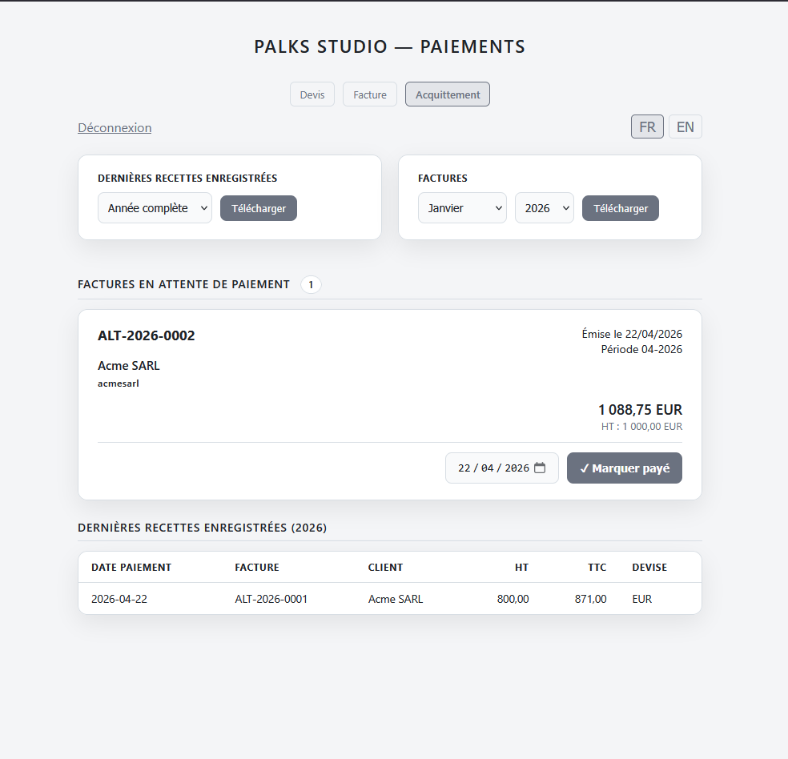

<p align="center">
  
</p>

> 🇫🇷 Français | [🇬🇧 English](./README.md)


<p align="center">
  <a href="https://palks-studio.com">
    
  </a>
</p>

# Billing System

> ⚠️ Ce dépôt présente le projet et sa documentation technique.  
> La version de production n’est pas distribuée publiquement.
>
> L’installation est réalisée directement sur l’hébergement du client.  
> Si vous souhaitez utiliser ce système, merci de contacter **Palks Studio**.

Système de facturation complet, autonome et bilingue (FR/EN), installable sur tout hébergement PHP/Apache. Aucune base de données. Aucune dépendance SaaS. Hébergement autonome avec contrôle total des données.

---

## Présentation générale

Billing System est une suite de trois outils de facturation reliés entre eux, accessibles depuis une interface unifiée. Il couvre l'intégralité du cycle de vie d'une prestation :  de l'émission du devis jusqu'à l'acquittement de la facture, en passant par la signature électronique et l'archivage structuré.

Le système est conçu pour être déployé directement chez le client, sur un hébergement Apache standard avec PHP 8.x et Composer. Il ne nécessite ni base de données, ni service tiers, ni abonnement.

---

## Fonctionnalités

- Génération de devis PDF côté navigateur (jsPDF)  
- Génération de facture PDF côté serveur (Dompdf)  
- Génération automatique de la facture acquittée au moment de la facturation  
- Signature électronique du devis par le client (canvas tactile/souris)  
- Auto-remplissage client depuis les archives (SIREN, SIRET, TVA, email, nom)  
- Archivage structuré par client et par période  
- Numérotation séquentielle sécurisée (verrou fichier)  
- Export mensuel des factures (archive ZIP) depuis l’interface  
- Export mensuel des recettes (CSV) depuis l’interface  
- Export annuel du journal des recettes (CSV)  
- Envoi email automatique à chaque étape (devis, facture, acquittement)  
- Navigation entre les trois modules depuis une barre commune  
- Interface bilingue FR/EN avec switch en temps réel  
- Mode sombre / mode clair persisté  
- Aucune base de données  
- Aucune dépendance SaaS  
- Sécurité minimale : sessions sécurisées, tokens, anti-brute force

---

## Structure du projet

```
billing-system-fr/
│
├── billing-public/
│   │  └── assets/
│   │      ├── logo*              → Logo de l'entreprise si fourni
│   │      ├── signature.png      → Signature de l'utilisateur utilisée sur les devis et les factures (format PNG)
│   │      ├── favicon*           → Favicon optionnel affiché dans l’onglet du navigateur
│   │      └── jspdf.umd.min.js   → Bibliothèque jsPDF utilisée pour générer les PDF dans le navigateur
│   │
│   ├── generator-direct.php      → Endpoint de génération de devis
│   ├── engine-direct.php         → Endpoint de génération de facture
│   ├── invoice-direct.php        → Endpoint de génération directe de facture
│   ├── paid-direct.php           → Endpoint de génération de facture acquittée
│   │ 
│   ├── quote-generator.php       → Interface de génération des devis
│   ├── invoice-engine.php        → Interface de génération directe de facture
│   ├── mark-paid.php             → Interface permettant de marquer une facture comme payée
│   ├── signer.php                → Interface de consultation et signature des devis
│   ├── export-invoices.php       → Export ZIP des factures archivées
│   ├── export-recettes.php       → Export CSV du journal des recettes
│   │
│   ├── config.php                → Configuration centrale de l’émetteur et des coordonnées bancaires
│   ├── lookup.php                → Recherche et auto-remplissage des informations client
│   ├── pdf-proxy.php             → Accès sécurisé aux PDF via token
│   ├── .htaccess                 → Règles de sécurité et configuration Apache
│   └── quote-generator-save.php  → Sauvegarde des devis générés et archivage
│
├── vendor/                       → Bibliothèques utilisées par le moteur de génération des documents
├── templates/                    → Modèles HTML utilisés pour le rendu des documents
│   └── invoice-template.php      → Template de rendu du document (PDF ou aperçu)
│
├── build_facturx_xml.php         → Génération du XML Factur-X
├── inject_facturx.py             → Injection du XML Factur-X dans le PDF
├── mailer.php                    → Script interne d’envoi d’emails avec pièces jointes
├── engine.php                    → Moteur principal : logique de génération, calculs et archivage
├── LICENCE.md                    → Licence du projet
│
├── contracts/                    → Archivage des devis signés et non signés
├── counters/                     → Compteurs de numérotation (devis et factures)
├── logs/                         → Journaux système (optionnel)
├── data/
│   ├── invoices/                 → Archivage des factures à régler
│   ├── invoices_state/           → Factures acquittées pré-générées (en attente de paiement)
│   ├── invoices_paid/            → Factures acquittées archivées
│   ├── tmp_facturx/              → Fichiers temporaires Factur-X
│   └── revenues/                 → Journal des recettes (CSV)
│
└── docs/
    ├── GUIDE_UTILISATEUR.md      → Guide utilisateur
    ├── OVERVIEW_FR.md            → Vue d’ensemble du projet et de son fonctionnement
    └── README_FR.md              → Documentation d’installation et d’utilisation (version client)
```


---

## Les trois modules

### 1. Générateur de devis (`quote-generator.php`)

Interface de création de devis avec génération PDF entièrement côté navigateur (jsPDF). Aucune donnée ne transite vers le serveur avant validation.

**Fonctionnement :**

1. L'utilisateur remplit le formulaire : coordonnées émetteur, coordonnées client, lignes de prestation, coordonnées bancaires, paramètres (devise, langue PDF).  
2. Un aperçu des totaux HT / TVA / TTC est calculé en temps réel.  
3. À la soumission, une fenêtre de confirmation s'affiche avant génération.  
4. Le PDF est généré localement et téléchargé. Simultanément, le devis est archivé côté serveur avec un token de signature valable 30 jours.  
5. Un email est envoyé au client avec un lien de consultation et de signature en ligne.

**Détails techniques :**

- La numérotation est automatique et repart de la base existante du client  
- Auto-remplissage client par SIREN, SIRET, TVA, email ou nom (lookup dans les archives)  
- Validation Luhn SIRET/SIREN côté navigateur  
- Auto-complétion SIREN depuis SIRET  
- Switch langue FR/EN en temps réel sans rechargement (100+ clés i18n)  
- Sélecteur devise : EUR, USD, GBP, CHF, CAD  
- Coordonnées bancaires (IBAN/BIC) conditionnelles dans le PDF  
- Bloc « Bon pour accord » avec image de signature configurable  
- Footer TVA conditionnel (art. 293B CGI si TVA = 0)  
- Pagination PDF automatique

---

### 2. Facturation directe (`invoice-engine.php`)

Interface de génération de facture côté serveur via Dompdf. Produit simultanément deux PDF à chaque génération : la facture normale et la facture acquittée (pré-générée, en attente de paiement).

**Fonctionnement :**

1. L'utilisateur remplit le formulaire : coordonnées client, lignes de prestation, date de prestation, acompte éventuel, référence de devis associé.  
2. À la soumission, le serveur valide les données, génère les deux PDF et archive les métadonnées.  
3. La facture normale est téléchargée automatiquement et envoyée au client par email avec pièce jointe.  
4. La facture acquittée est stockée dans `invoices_state/` en attente de confirmation de paiement.

**Détails techniques :**

- Numérotation annuelle au format `ALT-YYYY-0001` avec verrou fichier (`flock`). Le compteur repart de la base existante du client si des factures sont déjà présentes  
- Protection anti-double facturation sur référence de devis (HTTP 409)  
- Validation complète des entrées avec messages d'erreur FR/EN  
- Calcul `money2()` avec correction epsilon (précision float)  
- Agrégation TVA par taux  
- Logo PNG converti en JPEG via GD si disponible (gestion de la transparence pour Dompdf). Sans transparence, le résultat est identique  
- Récupération des coordonnées émetteur depuis le dernier `meta.json` connu  
- SHA256 du PDF archivé dans les métadonnées  
- Envoi email avec PDF en pièce jointe via mailer interne

---

### 3. Acquittement et suivi paiements (`mark-paid.php`)

Interface de suivi des factures en attente et d'acquittement. Affiche la liste des factures générées non encore payées, permet de les marquer comme payées, et tient un journal des recettes.

**Fonctionnement :**

1. Le module scanne automatiquement `invoices_state/` et liste toutes les factures acquittées pré-générées non encore validées.  
2. L'utilisateur choisit la date de paiement et clique « Marquer payé ».  
3. Le système déplace le PDF acquitté vers `invoices_paid/`, met à jour le `meta.json`, enregistre la ligne dans le CSV recettes, logue l'opération, et envoie la facture acquittée au client par email.  
4. Le tableau des 10 dernières recettes de l'année est affiché en bas de page.

**Détails techniques :**

- Scan récursif `RecursiveIteratorIterator` (détecte `_ACQUITTEE.pdf` et `_PAID.pdf`)  
- Filtre les factures déjà payées via `meta.json`  
- Déduplication CSV (vérifie le numéro avant append)  
- `flock` sur toutes les écritures fichier  
- Redirect POST→GET (`?success=`) pour éviter la resoumission  
- Badge compteur sur les factures en attente  
- Export CSV annuel `recettes-YYYY.csv` avec séparateur `;`

---

### Modules transverses

#### Signature électronique (`signer.php`)

Page publique accessible par le client via un lien tokenisé. Permet de consulter le devis et d'apposer une signature électronique.

- Aperçu PDF multi-pages via pdf.js  
- Canvas signature tactile et souris (devicePixelRatio, resize handler)  
- Validation format (data URI PNG, taille minimum)  
- Sauvegarde PNG de la signature  
- Mise à jour `meta.json` (`signed_at`, `sign_ip_hash`)  
- Double email de confirmation FR/EN : client + émetteur  
- Protection contre la double signature  
- Expiration du lien à 30 jours

#### Auto-remplissage client (`lookup.php`)

Endpoint JSON appelé à la saisie dans les formulaires. Recherche dans les archives de devis par SIREN, SIRET, TVA, email, nom ou numéro de devis.

- Retourne coordonnées complètes, lang, devise, liste des devis du client  
- Retourne les lignes du devis pour pré-remplissage automatique de la facture  
- Normalisation de la requête (suppression espaces SIREN/SIRET)  
- Triple passe de scan (contrats → devis exact → meta files)

#### Accès PDF sécurisé (`pdf-proxy.php`)

Proxy d'accès aux PDF par token. Permet de servir un PDF sans exposer son chemin physique.

#### Mailer interne (`mailer.php`)

Script d'envoi email avec support pièces jointes. Utilisé par tous les modules. Aucune dépendance SMTP externe.

---

## Sécurité

- Sessions PHP sécurisées : `httponly`, `secure`, `samesite=Strict`  
- Anti-brute force : blocage après 10 tentatives  
- `session_regenerate_id()` à chaque connexion réussie  
- Tokens signés `bin2hex(random_bytes(32))` pour les devis  
- Validation regex stricte des tokens (hex 64 chars)  
- Hash SHA256 de l'IP (RGPD-safe, non réversible)  
- Hash SHA256 du PDF archivé  
- Accès aux endpoints protégé par garde de session  
- `X-Content-Type-Options: nosniff` sur toutes les réponses  
- `Cache-Control: no-store` sur toutes les pages authentifiées  
- `noindex, nofollow` sur toutes les interfaces internes

---

## Emails automatiques

| Événement          | Destinataire(s)   | Contenu                                  |
|--------------------|-------------------|------------------------------------------|
| Génération devis   | Client            | Lien signature + lien téléchargement PDF |
| Signature devis    | Client + Émetteur | Confirmation de signature + lien PDF     |
| Génération facture | Client            | Facture en pièce jointe                  |
| Acquittement       | Client            | Facture acquittée en pièce jointe        |

Tous les emails sont bilingues FR/EN selon la langue du document.

---

## Prérequis techniques

- PHP 8.1 ou supérieur  
- Apache avec `mod_rewrite`  
- Composer  
- Extension GD (conversion logo PNG)  
- Fonction `mail()` active sur le serveur (ou SMTP configuré via mailer)  
- Dossiers `contracts/`, `data/`, `counters/`, `logs/` accessibles en écriture

---

## Archivage et données

Toutes les données sont stockées sous forme de fichiers plats. Aucune base de données n'est requise.

| Type                           | Emplacement                                | Format               |
|--------------------------------|--------------------------------------------|----------------------|
| Devis                          | `contracts/YYYY-MM/{client_id}/`           | PDF + meta.json      |
| Signatures                     | `contracts/YYYY-MM/{client_id}/`           | PNG                  |
| Factures                       | `data/invoices/{client_id}/YYYY-MM/`       | PDF + meta.json      |
| Factures acquittées (attente)  | `data/invoices_state/{client_id}/YYYY-MM/` | PDF                  |
| Factures acquittées (validées) | `data/invoices_paid/{client_id}/YYYY-MM/`  | PDF                  |
| Recettes                       | `data/revenues/recettes-YYYY.csv`          | CSV (séparateur `;`) |
| Compteurs                      | `counters/invoice_seq_YYYY.txt`            | Entier               |
| Logs                           | `logs/*.log`                               | Texte horodaté       |

---

© Palks Studio — voir LICENSE.md  
- https://palks-studio.com
