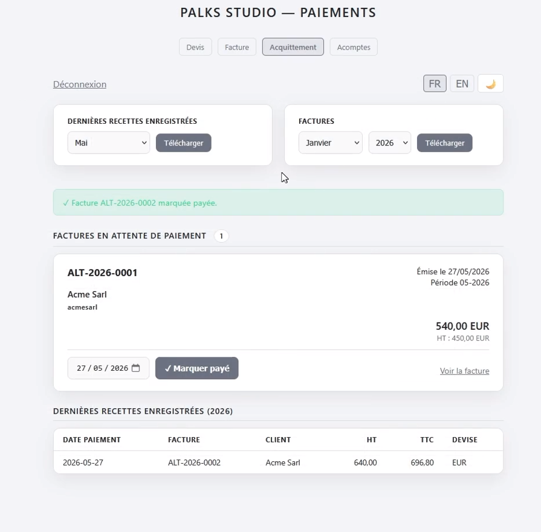

<p align="center">
  
</p>

> 🇫🇷 Français | [🇬🇧 English](./README.md)


[](https://palks-studio.com/fr/facturation-sans-saas)
[](https://www.youtube.com/@Palks_Studio)
[](https://www.linkedin.com/in/palks-studio/)

<p align="center">
  <a href="https://palks-studio.com">
    
  </a>
</p>

# Billing System

> ⚠️ Ce dépôt présente le projet et sa documentation technique.  
> La version de production n’est pas distribuée publiquement.

> L’installation est réalisée directement sur l’hébergement du client.  
> Si vous souhaitez utiliser ce système, merci de contacter **Palks Studio**.

Système de facturation complet, autonome et bilingue (FR/EN), installable sur tout hébergement PHP/Apache. Aucune base de données. Aucune dépendance SaaS. Hébergement autonome avec contrôle total des données.

[Voir le système](https://palks-studio.com/fr/facturation-sans-saas)

---

## Présentation générale

Billing System est une suite de quatre outils de facturation reliés entre eux, accessibles depuis une interface unifiée. Il couvre l'intégralité du cycle de vie d'une prestation :  de l'émission du devis jusqu'à l'acquittement de la facture, en passant par la signature électronique et l'archivage structuré.

Le système est conçu pour être déployé directement chez le client, sur un hébergement Apache standard avec PHP 8.x et Composer. Il ne nécessite ni base de données, ni service tiers, ni abonnement.

Curieux de découvrir l'application complète ? La playlist de démonstration est disponible ici : [Voir la playlist complète de démonstration](https://www.youtube.com/watch?v=RhYBwVY5I6E&list=PLQHDbUAfp4HM)

Le moteur intègre également un système de mise à jour sécurisé permettant de maintenir la conformité réglementaire dans le temps tout en conservant une installation autonome chez le client.

---

## Fonctionnalités

- Server-side PDF quote generation (mPDF)  
- Génération automatique de la facture acquittée au moment de la facturation  
- Signature électronique du devis par le client (canvas tactile/souris)  
- Auto-remplissage client depuis les archives (SIREN, SIRET, TVA, email, nom)  
- Archivage structuré par client et par période  
- Numérotation séquentielle sécurisée (verrou fichier)  
- Export mensuel des factures (archive ZIP) depuis l’interface  
- Export mensuel ou annuel des recettes (CSV) depuis l’interface  
- Export mensuel ou annuel des dépenses (CSV) depuis l’interface  
- Export mensuel ou annuel des acomptes (CSV) depuis l’interface  
- Envoi email automatique à chaque étape (devis, facture, acquittement)  
- Navigation entre les trois modules depuis une barre commune  
- Interface bilingue FR/EN avec switch en temps réel  
- Mode sombre / mode clair persisté  
- Aucune base de données  
- Aucune dépendance SaaS  
- Sécurité minimale : sessions sécurisées, tokens, anti-brute force  
- Gestion internationale : mentions légales TVA automatiques selon la zone client (FR / UE / hors UE)  
- TVA forcée à 0 % pour les clients UE et hors UE, avec mention légale adaptée  
- Validation du format et de la cohérence du numéro de TVA intracommunautaire client (préfixe pays, longueur attendue), appliquée côté interface et côté serveur  
- 249 pays centralisés dans `countries.php` — code ISO en backend, nom complet en interface  
- Autocomplétion pays sans accents, affichage en nom complet, transmission en ISO  
- Colonne TVA masquée dans les documents si aucune TVA applicable  
- Colonne `zone_tva` dans le journal des recettes CSV (valeurs : `fr`, `eu`, `world`)  
- Enregistrement et cumul des acomptes reçus par devis  
- Téléchargement sécurisé des factures PDF depuis l'interface de paiement  
- Suivi des acomptes par statut (non facturé, en attente, payé) avec filtres et pagination  
- Clôture mensuelle des acomptes payés avec export CSV et archivage JSON  
- Support des clients particuliers et professionnels avec adaptation automatique des champs d’identification  
- Gestion des informations d’assurance professionnelle (assureur, numéro de police et coordonnées)  
- Gestion multi-utilisateurs avec identifiants et mots de passe individuels  
- Sessions utilisateur indépendantes avec authentification sécurisée  
- International VAT handling with automatic legal notices based on client location (France / EU / non-EU), operation type (service or sale of goods), and issuer tax status  
- Support for services and sales of goods with automatic adaptation of applicable VAT legal notices  
- Enregistrement et suivi des dépenses professionnelles  
- Gestion des justificatifs (PDF, JPG, PNG)  
- Historique des dépenses avec filtres mensuels et annuels  
- Système de mise à jour automatique du moteur Factur-X avec notification intégrée dans toutes les interfaces  
- Vérification quotidienne de la disponibilité des nouvelles versions depuis l'installation cliente  
- Installation des mises à jour réglementaires après validation utilisateur  
- Vérification cryptographique des mises à jour avant installation  
- Sauvegarde automatique avant remplacement des composants du moteur  
- Mise à jour ciblée uniquement des fichiers nécessaires à la conformité réglementaire

---

## Structure du projet

```
billing-system/
│
├── billing-public/
│   │  └── assets/
│   │      ├── logo*                   → Logo de l’entreprise si fourni
│   │      ├── signature.png           → Signature de l’utilisateur utilisée sur les devis et factures (format PNG)
│   │      └── favicon*                → Favicon optionnel affiché dans l’onglet du navigateur
│   ├── admin/
│   │  └── system-maintenance.php      → Page de gestion des mises à jour
│   │
│   ├── quote-entry.php                → Point d’entrée de génération de devis
│   ├── billing-entry.php              → Point d’entrée de génération de facture
│   ├── instant-bill.php               → Point d’entrée de génération directe de facture
│   ├── payment-proof.php              → Point d’entrée de génération de facture acquittée
│   ├── deposit-entry.php              → Point d’entrée du suivi d'acomptes
│   ├── expenses-entry.php             → Point d’entrée de gestion des dépenses
│   │ 
│   ├── quote-space.php                → Interface de génération des devis
│   ├── billing-space.php              → Interface de génération directe de facture
│   ├── payment-check.php              → Interface permettant de marquer une facture comme payée
│   ├── expenses-check.php             → Interface permettant de suivre les dépenses
│   ├── payments.php                   → Interface permettant de suivre les acomptes
│   ├── payments-close.php             → Clôture mensuelle des acomptes payés
│   ├── approval.php                   → Interface de consultation et signature des devis
│   ├── archive-export.php             → Export ZIP des factures archivées
│   ├── revenue-export.php             → Export CSV du journal des recettes
│   ├── expense-export.php             → Export CSV du journal des dépenses
│   ├── deposit-export.php             → Export CSV du journal des acomptes
│   │
│   ├── index.php                      → Point d’entrée PWA et chargement du manifest
│   ├── countries.php                  → Liste ISO de 249 pays
│   ├── client-search.php              → Recherche et auto-remplissage des informations client
│   ├── secure-access.php              → Accès sécurisé aux PDF via token
│   ├── download-access.php            → Téléchargement sécurisé des factures PDF
│   ├── deposits.php                   → Enregistrement des acomptes reçus
│   ├── attachment.php                 → Visualisation des justificatifs
│   ├── manifest.json                  → Configuration PWA du système
│   └── archive-save.php               → Sauvegarde et archivage des devis générés
│
├── billing-updates/
│   │
│   ├── releases/                      → Versions publiées du moteur
│   │   ├── engine-release-1.0.0.zip   → Archive complète de la release
│   │   ├── engine-release-1.0.0.sig   → Signature cryptographique de la release
│   │   ├── engine-release-1.0.1.zip   → Archive complète de la release
│   │   └── engine-release-1.0.1.sig   → Signature cryptographique de la release
│   │
│   ├── api/
│   │   └── version-endpoint.php       → Point d'accès client pour récupérer la dernière version
│   │
│   ├── manifests/
│   │   └── release-manifest.json      → Manifest contenant la version, l'archive et la signature disponibles
│   │
│   ├── private/
│   │   ├── server-config.php          → Configuration privée du serveur de releases
│   │   ├── signing-private.key        → Clé privée utilisée pour signer les releases
│   │   └── signing-public.key         → Clé publique utilisée pour vérifier les signatures des releases
│   │
│   ├── source/
│   │   └── engine-source/             → Code source du moteur utilisé pour créer les releases
│   │       ├── xml-handler.py         → Script de traitement XML (mis à jour automatiquement)
│   │       ├── invoice.php            → Module moteur de facturation (mis à jour automatiquement)
│   │       ├── engine-module.py       → Module moteur (mis à jour automatiquement)
│   │       └── document-generator.php → Générateur de documents Factur-X (mis à jour automatiquement)
│   │
│   └── tools/
│       ├── release-builder.php        → Création automatique des archives de release et des manifests
│       └── release-signer.php         → Signature cryptographique des releases
│
├── vendor/                            → Bibliothèques utilisées par le moteur de génération des documents
├── templates/                         → Modèles HTML utilisés pour le rendu des documents
│   └── document-layout.php            → Template de rendu du document (PDF ou aperçu)
│
├── system-config.php                  → Configuration centrale de l’émetteur et des coordonnées bancaires
├── auth.php                           → Gestion des utilisateurs autorisés
├── facturx-builder.php                → Génération du XML Factur-X
├── facturx-injector.py                → Injection du XML Factur-X dans le PDF
├── mail-service.php                   → Script interne d’envoi d’emails avec pièces jointes
├── document-engine.php                → Moteur principal : logique de génération, calculs et archivage
├── LICENCE.md                         → Licence du projet
│
├── contracts/                         → Archivage des devis signés et non signés
├── counters/                          → Compteurs de numérotation (devis et factures)
├── logs/                              → Journaux système (optionnel)
├── data/
│   ├── pending-bills/                 → Archivage des factures à régler
│   ├── staged-payments/               → Factures acquittées pré-générées (en attente de paiement)
│   ├── paid-bills/                    → Factures acquittées archivées
│   ├── temp-facturx/                  → Fichiers temporaires Factur-X
│   └── revenue-ledger/                → Journal des recettes (CSV)
│
├── updater/
│   ├── update-check-module.php        → Vérification des mises à jour disponibles
│   ├── update-deployment-module.php   → Installation sécurisée des mises à jour
│   ├── update-alert-module.php        → Gestion des notifications de mise à jour
│   ├── version-cache.json             → Cache des vérifications de version
│   ├── verification.key               → Clé publique de vérification des signatures
│   ├── installation-state.json        → Version actuellement installée
│   └── operations.log                 → Journal des opérations de mise à jour
│
├── temp/
│   └── updates/                       → Zone temporaire utilisée pendant l'installation
│
└── docs/
    ├── GUIDE_UTILISATEUR.md           → Guide utilisateur
    ├── UPDATE_SYSTEM_FR.md            → Documentation du moteur de mise à jour automatique
    ├── OVERVIEW_FR.md                 → Vue d’ensemble du projet et de son fonctionnement
    └── README_FR.md                   → Documentation d’installation et d’utilisation (version client)
```


---

## Les quatre modules

### 1. Générateur de devis

**Fonctionnement :**

1. The user fills in the form: issuer details, client details, operation type (service or sale of goods), invoice lines, bank details, and document settings (currency and PDF language).  
2. Un aperçu des totaux HT / TVA / TTC est calculé en temps réel.  
3. À la soumission, une fenêtre de confirmation s'affiche avant génération.  
4. Le PDF est généré localement et téléchargé. Simultanément, le devis est archivé côté serveur avec un token de signature valable 30 jours.  
5. Un email est envoyé au client avec un lien de consultation et de signature en ligne.

**Détails techniques :**

- La numérotation est automatique et repart de la base existante du client  
- Auto-remplissage client par SIREN, SIRET, TVA, email ou nom  
- Validation Luhn SIRET/SIREN côté navigateur  
- Auto-complétion SIREN depuis SIRET  
- Switch langue FR/EN en temps réel sans rechargement  
- Sélecteur devise : EUR, USD, GBP, CHF, CAD  
- Coordonnées bancaires (IBAN/BIC) conditionnelles dans le PDF  
- Bloc « Bon pour accord » avec image de signature configurable  
- Footer TVA conditionnel (art. 293B CGI si TVA = 0)  
- Pagination PDF automatique  
- Gestion des clients particuliers et professionnels  
- Masquage automatique des identifiants d’entreprise pour les particuliers  
- Informations d’assurance professionnelle optionnelles  
- Support for both services and sales of goods with automatic VAT legal notice selection

---

### 2. Facturation directe

Interface de génération de facture côté serveur via mpdf. Produit simultanément deux PDF à chaque génération : la facture normale et la facture acquittée (pré-générée, en attente de paiement).

**Fonctionnement :**

1. The user fills in the form: client details automatically populated through lookup, operation type (service or sale of goods), client type (individual or business), professional insurance information, selection of the related quote, invoice lines automatically loaded from the selected quote, service date, and any applicable deposit.  
2. Un aperçu des totaux (HT / TVA / TTC) est calculé en temps réel.  
3. À la soumission, une fenêtre de confirmation s’affiche avant la génération.  
4. Le PDF est généré localement puis téléchargé. En parallèle, le devis est archivé côté serveur avec un jeton de signature valide pendant 30 jours.  
5. Un email est envoyé au client avec un lien pour consulter et signer le devis en ligne.

**Détails techniques :**

- Numérotation annuelle des factures avec mécanisme anti-collision  
- Protection contre la double facturation à partir d’une même référence de devis  
- Validation complète des entrées avec gestion des erreurs en français et en anglais  
- Calculs financiers précis avec gestion des imprécisions liées aux nombres flottants  
- Agrégation de la TVA par taux  
- Traitement automatique du logo pour compatibilité PDF  
- Récupération automatique des informations émetteur depuis les métadonnées existantes  
- Traçabilité des PDF via empreinte cryptographique (SHA-256)  
- Envoi des factures par email avec pièce jointe, sans dépendance externe

### Suivi des acomptes

L'interface de facturation permet d'enregistrer les acomptes reçus associés à un devis.  
Les montants s'accumulent à chaque enregistrement. Le total est automatiquement  
pré-rempli lors du chargement du formulaire via le lookup client.

---

### 3. Acquittement et suivi des paiements

Interface de suivi des factures en attente et de validation des paiements. Permet d’identifier les factures non réglées, de les marquer comme payées et de suivre les recettes.

**Fonctionnement :**  

1. Le module détecte automatiquement les factures en attente de paiement.  
2. L’utilisateur sélectionne une date de règlement et clique sur « Marquer comme payé ».  
3. Le système archive la facture comme acquittée, met à jour les métadonnées, enregistre la transaction dans le journal des recettes et envoie la facture au client par email.  
4. Un tableau des dernières recettes de l’année est affiché en bas de page.

**Détails techniques :**  

- Détection automatique des factures à traiter  
- Filtrage des factures déjà enregistrées comme payées  
- Prévention des doublons dans le journal des recettes  
- Gestion sécurisée des écritures (verrouillage)  
- Protection contre la double soumission des formulaires  
- Indicateur du nombre de factures en attente  
- Export des recettes au format CSV

---

### 4. Suivi des acomptes

Interface de consultation et de gestion des acomptes enregistrés sur les devis.

**Fonctionnement :**

1. Le module scanne les archives de contrats et liste tous les devis avec un acompte enregistré.  
2. Chaque entrée affiche le statut calculé dynamiquement : non facturé, en attente de paiement, ou payé.  
3. Les entrées peuvent être filtrées par statut et sont paginées par tranches de 20.  
4. Une clôture mensuelle permet d'archiver les acomptes dont la facture est payée.

**Clôture mensuelle :**

- Sélection de l'année et du mois à clôturer  
- Export CSV téléchargeable automatiquement  
- Archivage JSON dans le répertoire dédié  
- Marquage `archived: true` dans les métadonnées du contrat  
- Les entrées archivées disparaissent de la vue active

**Détails techniques :**

- Lecture seule — aucune écriture sur les données existantes hors clôture  
- Scan combiné des factures en cours et payées pour déterminer le statut  
- Compatible PHP 7

---

### Modules transverses

Composants partagés au sein du système, assurant cohérence, sécurité et automatisation.

#### Signature électronique

Page publique accessible via un lien sécurisé. Permet au client de consulter le devis et d’apposer une signature électronique.

- Aperçu PDF multi-pages dans le navigateur  
- Capture de signature (compatible tactile et souris)  
- Validation des entrées (format et taille minimale)  
- Enregistrement de l’image de signature  
- Mise à jour des métadonnées avec horodatage et traçabilité  
- Envoi d’emails de confirmation au client et à l’émetteur (FR/EN)  
- Protection contre la double signature  
- Expiration du lien après 30 jours

#### Auto-remplissage client

Endpoint JSON utilisé lors de la saisie des formulaires. Recherche dans les données existantes via SIREN, SIRET, TVA, email, nom ou numéro de devis.

- Retour des coordonnées complètes, type de client, langue, devise et éléments associés  
- Pré-remplissage automatique des factures à partir des devis existants  
- Normalisation des entrées pour garantir la cohérence des correspondances

#### Accès PDF sécurisé

Couche d’accès basée sur un jeton permettant de servir un PDF sans exposer son emplacement physique.

#### Mailer interne

Module d’envoi d’emails avec gestion des pièces jointes, utilisé par l’ensemble du système. Aucune dépendance à un service SMTP externe.

---

## Système de mise à jour du moteur

Le système intègre un mécanisme de mise à jour automatique permettant de maintenir le moteur Factur-X conforme aux évolutions réglementaires.

Chaque installation cliente vérifie périodiquement la disponibilité d'une nouvelle version auprès du serveur de mise à jour Palks Studio.

Lorsqu'une nouvelle version est disponible :  

- une notification apparaît dans l'ensemble des interfaces du système  
- l'utilisateur peut consulter les informations de la mise à jour  
- l'utilisateur peut lancer l'installation directement depuis l'interface

Le processus de mise à jour :

- télécharge uniquement les composants du moteur concernés  
- vérifie la signature cryptographique de la release  
- crée une sauvegarde avant modification  
- remplace uniquement les fichiers nécessaires  
- conserve les données clients et configurations locales  
- met à jour la version installée

Ce mécanisme permet d'assurer la continuité de conformité réglementaire du moteur sans intervention technique sur le serveur client.

---

## Sécurité

- Gestion sécurisée des sessions (cookies protégés, isolation des accès)  
- Protection contre les tentatives de brute force  
- Régénération des identifiants de session après authentification  
- Utilisation de jetons sécurisés pour l’accès aux ressources sensibles  
- Validation stricte des entrées et des identifiants  
- Traçabilité des actions via empreintes cryptographiques  
- Protection des endpoints par contrôle d’accès  
- Politique de sécurité des réponses HTTP (type, cache, indexation)  
- Interfaces internes non indexées et non exposées publiquement  
- Aucune dépendance à des services externes : toutes les données restent sous contrôle  
- Authentification multi-utilisateurs via comptes dédiés  
- Double validation des données (interface et serveur) sur les champs sensibles, dont le numéro de TVA intracommunautaire

---

## Emails automatiques

| Événement          | Destinataire(s)   | Contenu                                  |
|--------------------|-------------------|------------------------------------------|
| Génération devis   | Client            | Lien signature + lien téléchargement PDF |
| Signature devis    | Client + Émetteur | Confirmation de signature + lien PDF     |
| Génération facture | Client            | Facture en pièce jointe                  |
| Acquittement       | Client            | Facture acquittée en pièce jointe        |

Tous les emails sont bilingues FR/EN selon la langue du document.

---

## Prérequis techniques

- PHP 8.1 ou supérieur  
- Serveur web compatible (Apache recommandé)  
- Gestion des réécritures d’URL  
- Extension GD (traitement des images)  
- Fonction d’envoi d’emails active côté serveur  
- Droits d’écriture sur les répertoires de stockage et d’archivage

---

## Archivage et données

Toutes les données sont stockées sous forme de fichiers plats. Aucune base de données n’est requise.

| Type                     | Description                                      | Format              |
|--------------------------|--------------------------------------------------|---------------------|
| Devis                    | Archivés avec leurs métadonnées associées        | PDF + métadonnées   |
| Signatures               | Stockées sous forme d’images                     | PNG                 |
| Factures                 | Archivées avec leurs métadonnées associées       | PDF + métadonnées   |
| Factures en attente      | Pré-générées en attente de validation            | PDF                 |
| Factures acquittées      | Archivées après confirmation de paiement         | PDF                 |
| Recettes                 | Export structuré des transactions                | CSV                 |
| Compteurs                | Suivi de la numérotation séquentielle            | Entier              |
| Logs                     | Journal des activités du système                 | Texte horodaté      |
| Archives acomptes        | Archivage mensuel des acomptes clôturés          | JSON + CSV          |

---

© Palks Studio — voir LICENSE.md  
- https://palks-studio.com
